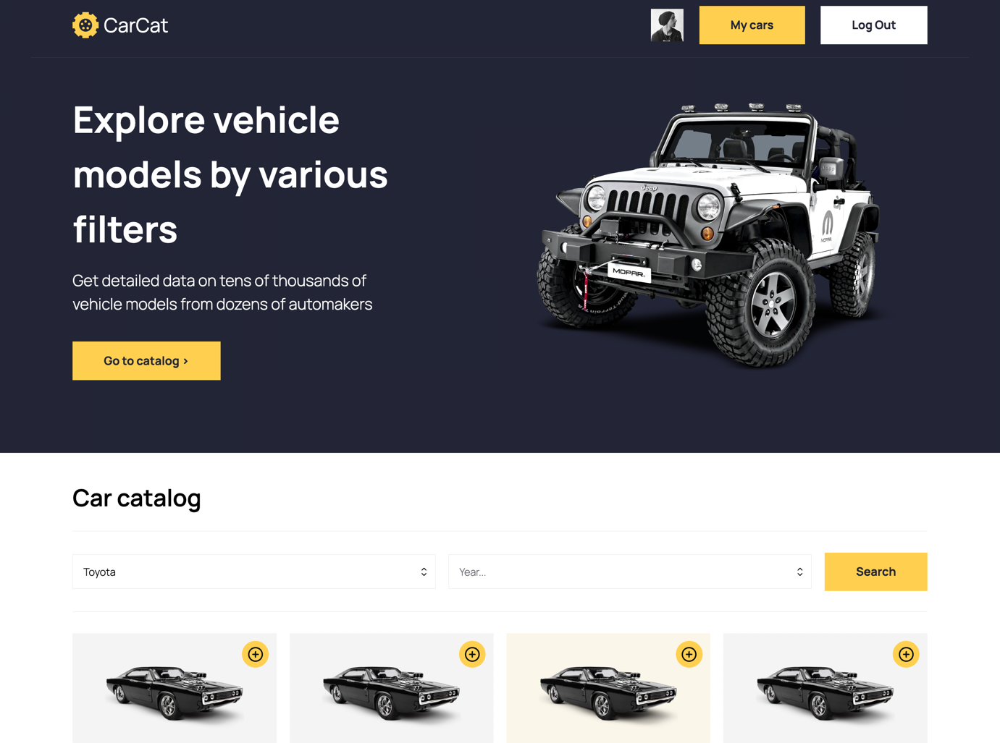
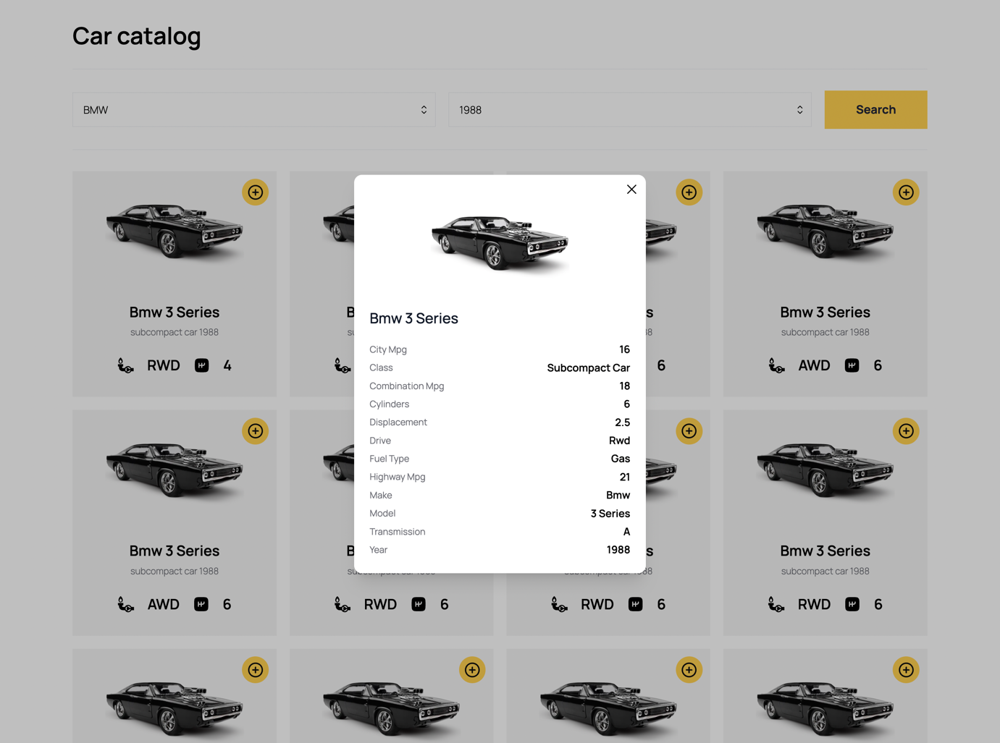
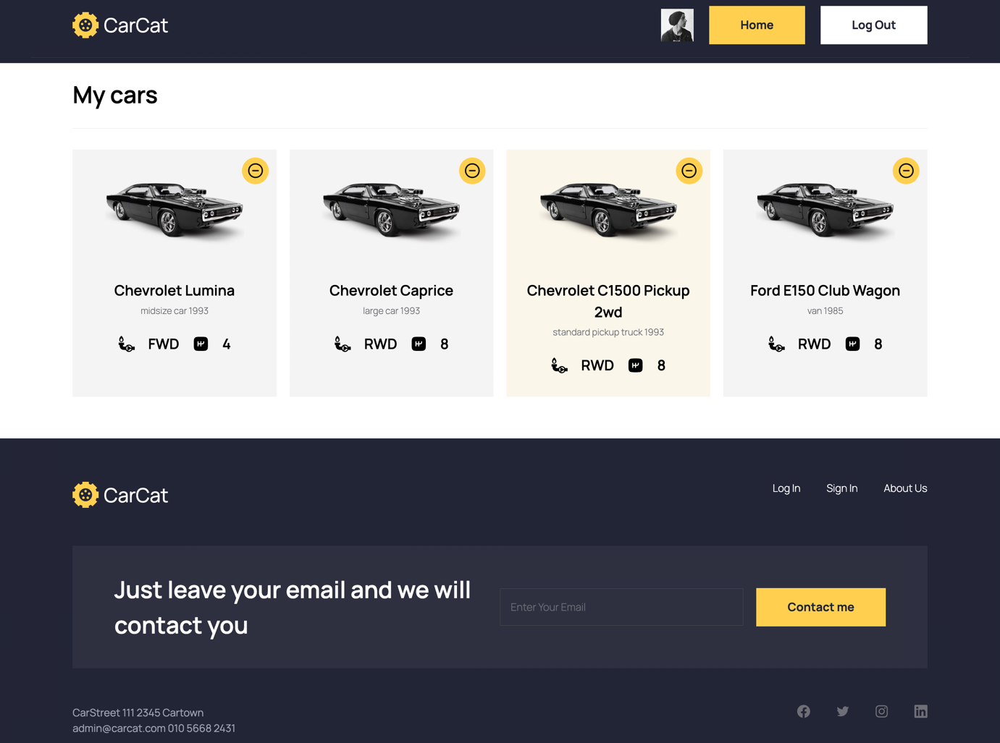

# Car Catalog App

## Description

The Car Catalog App is a web application that provides information about automobiles. It can be used as both a car sales and rental platform, offering users the ability to filter cars by manufacturer and year of manufacture. The application utilizes the Cars by API-Ninjas API to retrieve car data. Additionally, it features Google authentication for users to save their favorite cars. The app is fully responsive and built using the following technologies: Next.js, Next Auth, React, TypeScript, MongoDB, and Tailwind CSS.

## Features

- **Car Information**: Access detailed information about various car models, including specifications, images, and more.

- **Filtering**: Easily filter cars by manufacturer and year of manufacture to find the perfect vehicle.

- **Authentication**: Use Google authentication to create and manage user accounts.

- **Favorites**: Allow users to save their favorite cars for quick access.

- **Responsive Design**: The app is fully responsive, ensuring a seamless experience on both desktop and mobile devices.

## Technologies Used

- **Next.js**: A React framework for building fast and scalable web applications.

- **Next Auth**: An authentication library for Next.js that supports various authentication providers, including Google.

- **React**: A JavaScript library for building user interfaces.

- **TypeScript**: A statically typed superset of JavaScript for enhanced development.

- **MongoDB**: A NoSQL database for storing and managing data efficiently.

- **Tailwind CSS**: A utility-first CSS framework for building responsive and customizable web designs.

## Installation

To run the Car Catalog App locally, follow these steps:

1. Clone this repository:

   ```bash
   git clone https://github.com/xmal0x/carCat.git
   ```

2. Navigate to the project directory:

   ```bash
   cd carCat
   ```

3. Install the dependencies:

   ```bash
   npm install
   ```

4. Configure environment variables by creating a `.env` file with the following content:

   ```plaintext
    API_KEY=your-cars-by-api-ninjas-key
    GOOGLE_ID=your-google-client-id
    GOOGLE_SECRET=your-google-client-secret
    MONGODB_URI=your-mongodb-uri
    NEXTAUTH_URL=http://localhost:3000
    NEXTAUTH_URL_INTERNAL=http://localhost:3000
    NEXTAUTH_SECRET=your-next-auth-secret
   ```

5. Start the development server:

   ```bash
   npm run dev
   ```

6. Open your web browser and access the app at `http://localhost:3000`.

## Usage

1. Sign in using your Google account to access personalized features.

2. Browse the car catalog, filter cars, and view detailed information.

3. Save your favorite cars by clicking the "Add to Favorites" button.

4. Access your saved favorites in the app for quick reference.

## Images

Main section


Car details


Favorite cars


## Deployment

You can deploy the Car Catalog App to various hosting platforms such as Vercel, Netlify, or your preferred hosting service. Make sure to configure the deployment settings, including environment variables, according to the platform's documentation.

## Acknowledgments

- Thanks to API-Ninjas for providing the car data API.

- Special thanks to the Next.js, React, and TypeScript communities for their excellent libraries and resources.
